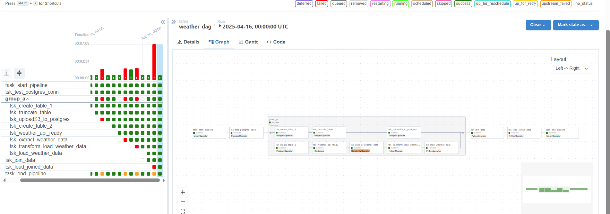

## 🌦 OpenWeather ETL Pipeline на AWS

Цей проєкт реалізує повний ETL-процес збору, обробки та зберігання погодних даних з OpenWeather API в Amazon RDS PostgreSQL, з наступною агрегацією та збереженням результатів у Amazon S3. Оркестрація виконується за допомогою Apache Airflow.

---

### 🧱 ERD (Схема)


---

### 🚀 Функціональність DAG

- Підключення до OpenWeather API через `HttpSensor` та `SimpleHttpOperator`
- Трансформація даних з Kelvin → Celsius
- Завантаження у таблицю `weather_data`у RDS PostgreSQL
- Імпорт `city_look_up` з S3 у RDS PostgreSQL
- JOIN таблиць в PostgreSQL
- Збереження результату у S3 у вигляді `.csv`

---

### ⚙️ Запуск проєкту

#### 1. Налаштування AWS

```bash
aws configure
```

---

#### 2. Створення EC2 та Elastic IP

```bash
chmod +x create_ec2_with_elastic_ip.sh
./create_ec2_with_elastic_ip.sh
```

---

#### 3. Створення RDS PostgreSQL

```bash
chmod +x create-rds-postgres.sh
./create-rds-postgres.sh
```

---

#### 4. Встановлення PostgreSQL локально

```bash
chmod +x install_postgresql.sh
./install_postgresql.sh
```
# 4.1 Підключаємося для перевірки
```bash
psql -h rds-db-for-open-weather......us-west-2.rds.amazonaws.com -p 5432 -U postgres -W
\db
\dt
\?

CREATE EXTENSION aws_s3 CASCADE;
\q
```

---

#### 5. Встановлення Airflow

```bash
bash install_airflow_deps.sh
```

> Увімкне `airflow standalone` у середовищі `airflow_venv`

---

#### 6. Запуск DAG

Перейдіть до веб-інтерфейсу Airflow (`http://<Public IPv4 DNS>:8080`) 
Переконайтесь, що:
- У вас створено підключення до Postgres: `postgres_conn`
- Створено підключення до HTTP API: `weathermap_api`
- Установлено змінну: `openweathermap_api_key`

і активуйте DAG `weather_dag`.

---

### 🧮 Таблиці

- `city_look_up`: з даними по містах, імпорт із S3
- `weather_data`: погода з OpenWeather API
- JOIN результат → збереження в S3 joined_weather_data_.csv

---

### Працюючий даг



---

### 🧑‍💻 Автор

**Dmytro Turchynskyi**  
GitHub: [TurchinskiyD](https://github.com/TurchinskiyD)